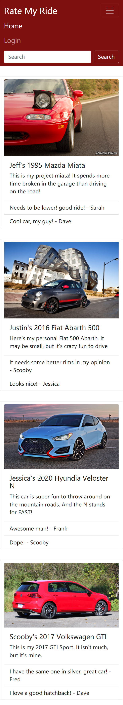

# **Rate My Ride**

> ## **_Description_**

This is a platform share with others.

---

### **_Table of Contents_**

- [Installation](#installation)
- [Usage](#usage)
- [Screen Shots](#Screen-shots)
- [Demo](#demo)
- [Features](#features)
- [Contribution](#contribution)
- [License](#license)

> ## **_Installation_**

```
npm install
```

> ## **_Usage_**

Here are some technologies used in the project.

- Node
- Express
- SQL
- Sequelize
- dotenv
- ejs

> ## **_Screen-shots_**
>
> **`Wider Screen`**


**`Mobile Screen`**



> ## **_Demo_**

https://rate-my-riide.herokuapp.com/

> ## **_Features_**

- UI update

  - Add a logo as favicon
  - Add description videos/images link (Instagram, Tiktok, Facebook)
  - Build dropdown list to show multiple comments
  - Each user can add more than one vehicle

- Rating system

  - Allow other users rate cars
  - Filter by rating stars

- Social Group
  - User can tag friends on posts and comments
  - User can create car groups with friends

> ## **_Contributing_**

Albert Jiang, Wyatt Simmons, Alejandro Robles

❤️

If you created an application or package and would like other developers to contribute it, you will want to add guidelines for how to do so. The [Contributor Covenant](https://www.contributor-covenant.org/) is an industry standard, but you can always write your own.

> ## **_License_**


Copyright (c) [year] [fullname]

https://choosealicense.com/licenses/mit/
